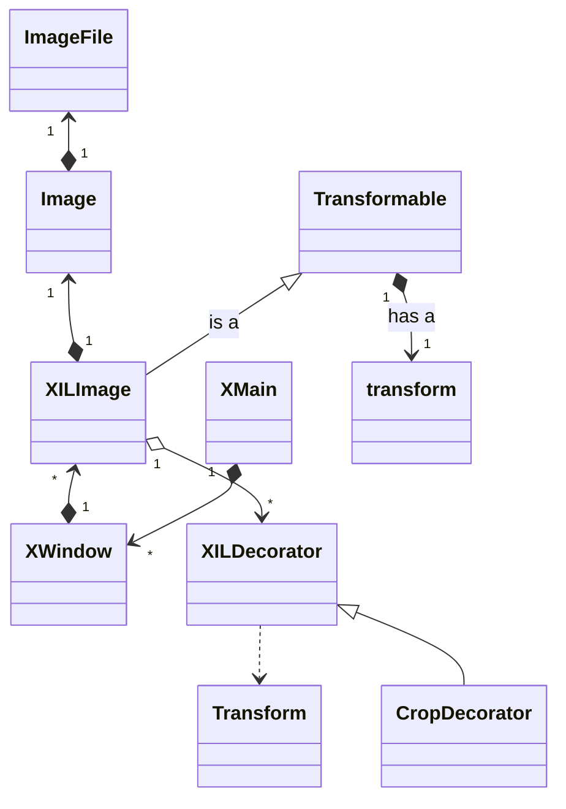

# Classes

This document attempts to describe the program structure with the class structure in particular
and related design choices and patterns.

This may look slightly complicated partly due to the way Mermaid lays it out but the gist of it is:

- XMain is the main application
- XWindow corresponds to a screen (a monitor)
  - It must be a QWindow so it can receive X events from Qt 
- XILImage is the main window file; it's so named because the code initially used the IL image library
  - XILImage represents an image as it appears on its XWindow (usually /in/ the window)
    - Image represents an image as loaded from storage; it can have image-specific transformations applied to it.
    - ImageFile represents the image as stored on its media; the actual file is never changed
      - The intention is that different media could hold the same file
- XILDecorator adds temporary design to a XILImage
  - This design can be converted to a (permanent) Transform (eg crop), in a factory pattern
  - Transforms can also be generated independently
  - Transforms are collected together in a transform object
  - Most transforms are stored with the Image, as they would be image specific
    - E.g. it is assumed that the image will be cropped the same way
